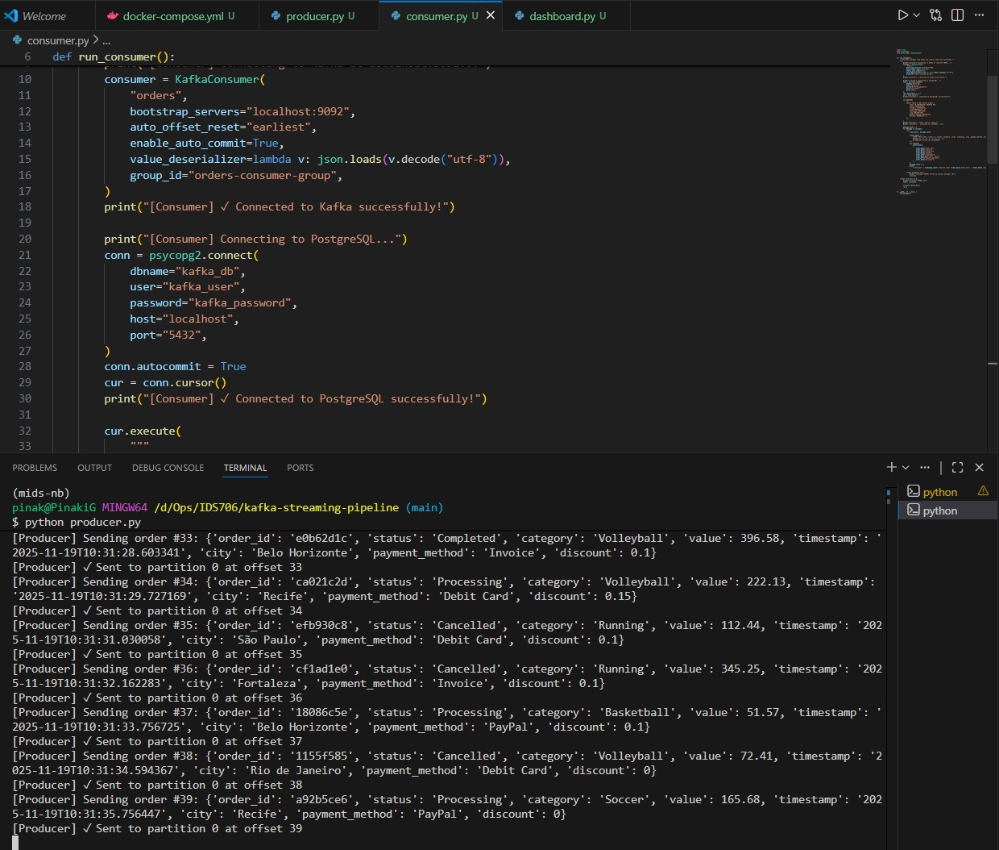

# kafka-streaming-pipeline
Real-Time Ride-Sharing Stream Processing Pipeline

A Kafka → Postgres → Streamlit system for real-time trip monitoring

This project implements a complete real-time data engineering pipeline using Apache Kafka, PostgreSQL, and Streamlit.
Originally built on an e-commerce order example, this customized version extends the system to the ride-sharing domain (e.g., Lyft/Uber-style trips) with synthetic live trip events streaming end-to-end through the system.

## Producer Running

## Consumer Inserting Records

## Dashboard Demo Video
[Click to view demo video](media/Ridesharing_Real_Time_Dashboard.webm)

# Architecture Overview

Synthetic Trip Generator (Producer)
        ↓ (Kafka topic: "orders")
Kafka Broker (real-time stream)
        ↓
Kafka Consumer → PostgreSQL (orders table)
        ↓
Streamlit Dashboard (auto-refreshing analytics)

# Media Preview

Producer Running

Consumer Writing to Postgres

Dashboard View

Dashboard Demo Video

# ✔ Key Features

1. Producer Implementation (10 pts)

producer_upd.py generates synthetic ride-sharing trips:

trip_id

trip_type (Economy, Premium, Shared, XL)

trip_status (Requested, Ongoing, Completed, Cancelled)

fare_usd (calculated from distance)

city

payment_method

discount

Streams JSON messages to Kafka topic orders

2. Kafka Configuration & Streaming (10 pts)

Kafka broker running via Docker Compose

Producer → Kafka → Consumer all connected on localhost:9092

3. Consumer Functionality (10 pts)

consumer_upd.py consumes trip events from Kafka

Inserts records into PostgreSQL using psycopg2

Retains original table and schema (orders) but repurposes fields to trip semantics

4. Database Schema & Persistence (10 pts)

The Postgres table:
CREATE TABLE IF NOT EXISTS orders (
    order_id VARCHAR(50) PRIMARY KEY,
    status VARCHAR(50),
    category VARCHAR(50),
    value NUMERIC(10, 2),
    timestamp TIMESTAMP,
    city VARCHAR(100),
    payment_method VARCHAR(50),
    discount NUMERIC(4, 2)
);
Continuous write pipeline validated

5. Data Flow Integration (10 pts)

Live trip data flows continuously from producer → Kafka → Postgres → dashboard

Verified end-to-end with screenshots and demo video

6. Real-Time Dashboard (15 pts)

dashboard_upd.py features:

Auto-refreshing Streamlit UI

KPIs: total trips, total fare, average fare, completion rate

Charts:

Total fare by trip type

City-level fare distribution

Filters:

Trip status filter

Data window limit

Dashboard Example

7. Creativity & Other Modifications (20 pts)

Minimal but meaningful enhancements:

Domain changed to ride-sharing

Synthetic trip generator with configurable randomness

Dashboard labels and KPIs adapted

Clean structure + media documentation

Maintains simplicity as required for a mini-project

8. Documentation Quality (15 pts)

This README:

Explains system architecture

Shows screenshots + video

Links code components

Provides full run instructions

Maps clearly to each rubric section

🚀 Run the Project
1. Start Kafka + Postgres
docker-compose up -d

2. Run the Producer
python producer_upd.py

3. Run the Consumer
python consumer_upd.py

4. Run the Dashboard
streamlit run dashboard_upd.py

Open in browser:

http://localhost:8501

## Repository Structure

/
├── producer_upd.py
├── consumer_upd.py
├── dashboard_upd.py
├── docker-compose.yml
├── requirements.txt
├── README.md
│
├── media/
│   ├── producer_running.png
│   ├── consumer_running.png
│   ├── dashboard_demo.png
│   └── dashboard_demo.mp4
│
└── Helper Codes/ 

